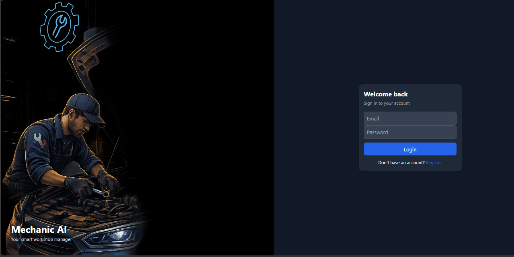
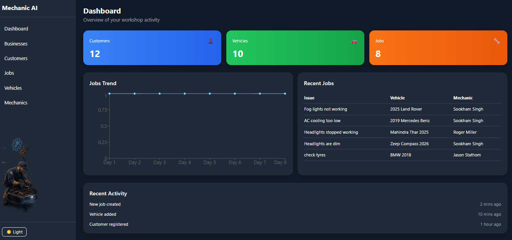
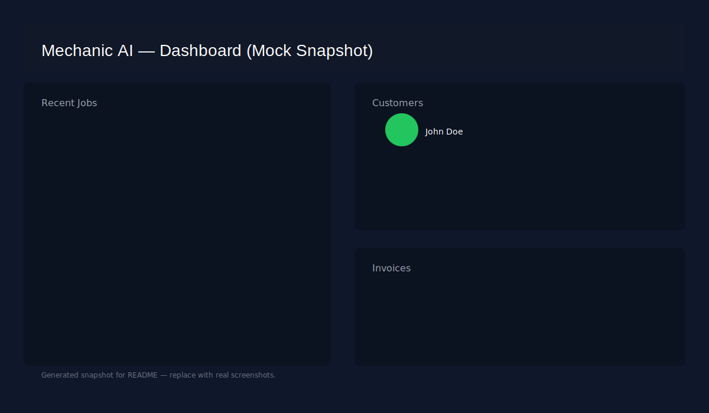
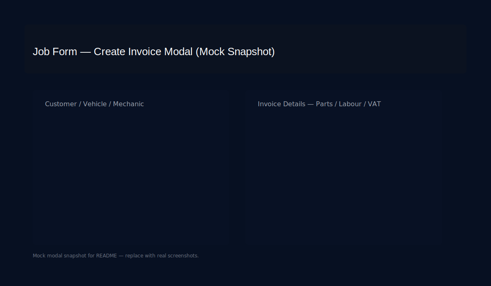

# Mechanic AI

This app is developed for ganrage management system to tackle various jobs for automobile work. With AI support using generative AI, it helps end to end workflow of taking up a job/work, suggests on what issues are and solution. It also generates AI auto-invoices and also allows users to cutomize the cost/fee. Feel Free to register and give it a try. Let me know your views/suggestions.

https://mechanic-ai-ui.onrender.com




This repository contains a FastAPI backend and a React frontend for a mechanic workshop management app with AI-assisted diagnostics and invoice generation.

---

## Overview

- Backend: FastAPI (Python) with Postgres for persistence. Generates server-side PDFs for invoices.
- Frontend: React app in `ui/mechanic-ui` that talks to the backend using JWT auth.

---

## Quick Start — Backend

Requirements: Python 3.10+, Postgres.

1. Create and activate a virtual environment:

```bash
python -m venv .venv
.venv\Scripts\activate    # Windows
# or
source .venv/bin/activate # macOS / Linux
```

2. Install requirements:

```bash
pip install -r requirements.txt
```

3. Configure environment variables (example):

- `DB_HOST` (default: 127.0.0.1)
- `DB_PORT` (default: 5432)
- `DB_NAME` (default: mechanic_db)
- `DB_USER` (default: postgres)
- `DB_PASSWORD` (default: sameer)
- `OPENAI_API_KEY` (optional, for AI features)

You can also set `DB_CONNECT_TIMEOUT` to reduce startup blocking when the DB is down.

4. Initialize or migrate DB (server startup will auto-run `init_db`):

```bash
uvicorn app.main:app --reload
```

5. Create a user and obtain a JWT (the repo contains basic auth helpers).

Token lifetime: by default tokens expire after 24 hours (see `app/auth.py`). To change, modify the `timedelta` in `create_token()`.

---

## Quick Start — Frontend

1. Change into the UI folder and install dependencies:

```bash
cd ui/mechanic-ui
npm install
```

2. Start the dev server:

```bash
npm start
```

3. The frontend expects the backend at `http://localhost:8000`. Update `ui/mechanic-ui/src/api.js` if your backend host/port differ.

---

## Invoice & PDF

- Invoices are created via the backend `/invoices` endpoint and a server-generated PDF is available at `/invoices/{id}/pdf`.
- The backend stores `vat_rate`, `vat_amount`, and `currency` on each invoice (see `app/init_db.py` and `app/routes/invoice.py`).

---

## Development Notes

- Database connection uses environment variables (see `app/db.py`).
- Auth uses JWT with HS256; token expiry is set in `app/auth.py`.
- The AI diagnosis endpoint uses OpenAI; ensure `OPENAI_API_KEY` is set for `ai/diagnose` to work.

---

## Frontend Snapshots

Below are sample snapshots of the frontend UI. Replace these with real screenshots if desired.

### Dashboard



### Job Form / Invoice Modal



---

## Troubleshooting

- If the backend fails at startup, check DB connectivity and environment vars.
- If the frontend fails to build due to modern JS features, ensure Node.js is up-to-date (v16+ recommended).
